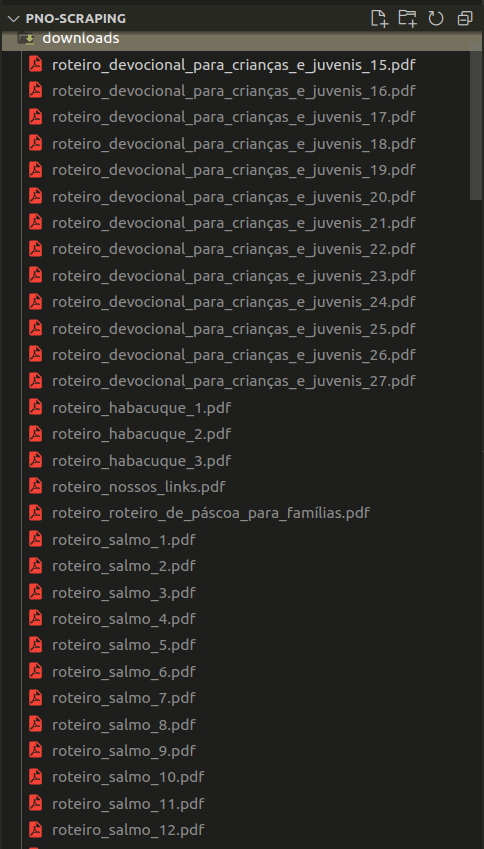

# pno-scraping
Este projeto se propõe a fazer rapagem de dados (Web scraping) para obter os roteiros de culto familiar em PDF fornecidos em www.perguntarnaoofende.com. Devido a grande quantidade desses roteiros, cada um se concontrando em uma url específica (totalizando no mínimo 160), justifica-se a automação dos downloads de tais documentos.

Para isso, utilizei a linguagem Python, com algumas bibliotecas:

- <em>flake8</em>: para auxiliar na formatação do código
- <em>requests</em>: para fazer requisiçoes GET
- <em>parsel</em>: para manipular dados obtidos a partir das requisições
- <em>dotenv</em>: para utilização de variáveis de ambiente

## Instalação
### Cria e ativa ambiente virtual
`python3 -m venv .venv && source .venv/bin/activate`

### Instalando *requests*
`python3 -m pip install requests`

### Instalando *flake8*
`pip install flake8`

### Instalando *parsel*
`python3 -m pip install parsel`

### Instalando *dotenv*
`pip install python-dotenv`

### Antes de executar
1. Em `.env_example`, defina o caminho dos arquivos a serem baixados em PATH_FILE e a quantidade dos arquivos em AMOUNT
2. Mude o nome de `.env_example` para `.env`

### Executando
No diretório raiz, execute:
`python3 main.py`

### Resultado
No diretório escolhido, serão encontrados os arquivos baixados:

